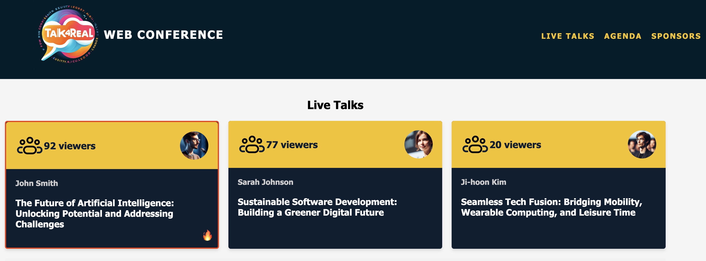

# Now4real Example Conference

This repository showcases the implementation of an online conference website, specifically the "Talk4Real Web Conference". The main focus is on demonstrating the utilization of the api+widget target provided by the Now4real API.

## Key Concepts Illustrated:

- **Install the Widget with Site Scope:** Learn how to integrate the Now4real widget with a site-wide scope in the homepage.

- **Embed the Widget with Page Scope:** Explore the process of embedding the Now4real widget with a page-specific scope, within individual talk pages.

- **Display Counters from Other Pages:** Understand how to showcase counters indicating the number of listeners engaged in ongoing talks, within the homepage.

- **Display the Ranking of Most Viewed Pages:** Discover how to present a realtime ranking of the most viewed talks, within individual talk pages.

## Demo Site

Visit the live demo of the conference [here](https://now4real.github.io/example-conference/).

Feel free to explore the source code to better understand the implementation details. If you have any questions or feedback, don't hesitate to reach out!

Happy coding!